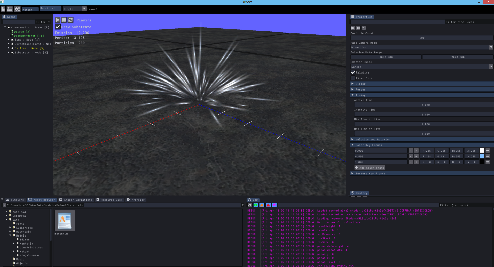
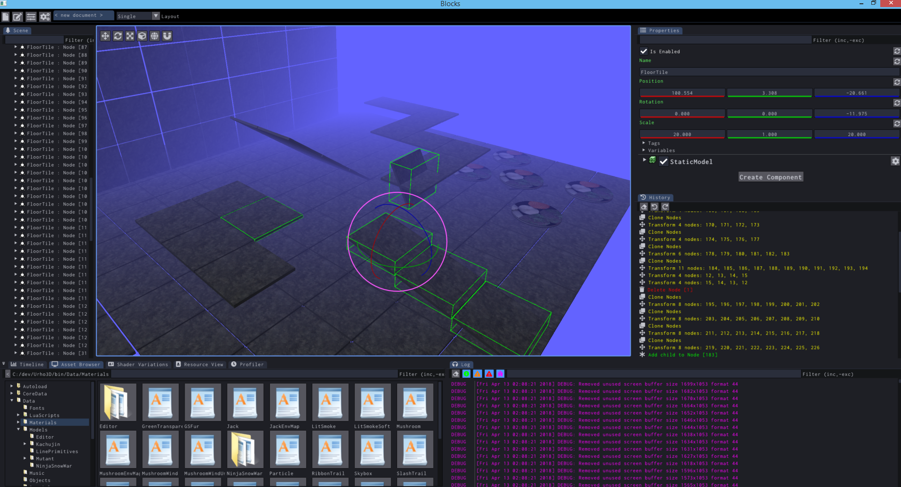
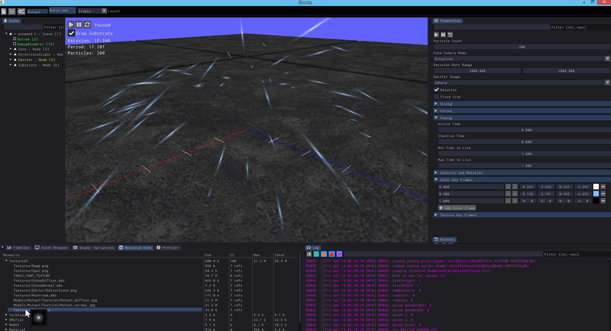
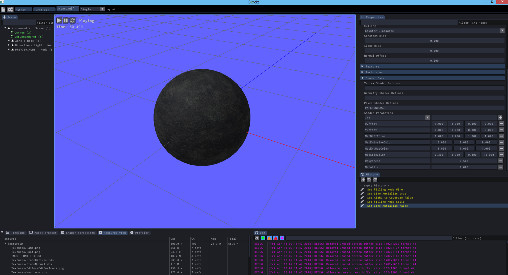
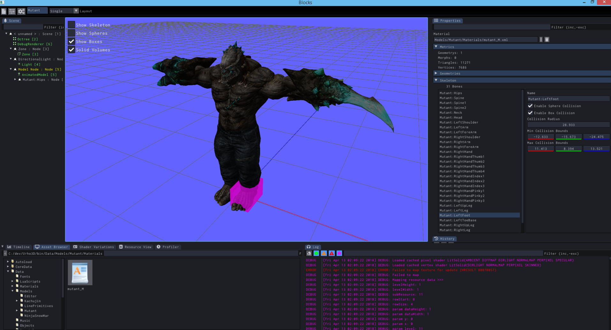

# Blocks Editor

[TOC]

## Source-code is all rights reserved

Source is only provided as a reference and is not for use or redistribution, I reserve all rights to it.

Source quality is quite poor as it's the product of baking down generated source code followed with some very light refactoring. Thus, files like `GUI_Main` contain practically everything because all code generation was emitted into those locations. Order of functions and the like may not be sensible depending on what part of the emission pass they're emitted from.

Again, 100% proprietary and solely provided for closed door viewing.

---

Multiple document editor for Urho3D. Brings forward only the most important functionality.



**No**, that wildness in the Scenetree was **never** meant to be touched by human hands. The cooked down HierarchialDataTemplate is anything but pretty.

### Major To-Dos

... that may make things unpleasant.

Keyboard accelerators and shortcuts are not present. Due to debate on where they belong, either as general purpose bindings in Urho3D that are intercepted before they reach the GUI or through the GUI itself.

Dock panels cannot be closed/hidden. Mostly just a detail.

There's not threading at all - slows down thumbnail loading quite a bit.

## Core Functionality

###Scene Tree

- Name Coloration
  - White is regular
  - Yellows are temporary
  - Cyan is a prefab instance
  - Red is disabled
- Drag nodes onto Node ID fields
- Drag components onto Component ID fields
- CTRL + Click to multi-select or deselect
- Right Click for context menu
- Filter by node name

###Properties

- Filtering
- Reset properties to default value
- Resource references
  - Drag and drop from Asset Browser
  - Use *...* for file chooser
  - Use Trashcan to clear
  - Use Edit to open in either appropriate document or using system program
- *TODO*: Select Node ID / Component ID values from a picker
- *TODO:* PFL input methods (or a QE method)

###Message Log

- Log can be cleared, filtered, and message visibility toggled

###Shader Variations

- View loaded shaders and the preprocessor definitions used by them
- For figuring out what combinations you need to be potentially concerned about

###Profiler

###Resource Cache

- View current loaded resources and sizes
- Thumbnail preview of 2D texture resources
- Force Reload or Unload

###History (Undo/Redo)

- Clearable
- **! Support is incomplete !** for documents other than scene

###Asset Browser

- Drag and drop onto resource reference attributes
- *Favorites* folder support
- *Recent* folders based on use since program start
  - Inclusion is determined by a drag-and-drop from that folder
- Thumbnail previews of previewable files
- File Context Menu 
  - Open
    - Open either with application document type (particle, material, model) or using system open
  - Angelscript Files
    - Run as one off script
      - Loads file and executes **`void main()`**
    - Run as Editor Script
      - Loads file and executes **`void main(Scene@ documentScene)`**
  - Play Sound (wav files only)

###Scripting and Extension Functionality

Blocks can be customized to do specialized tasks.

####Template Scenes

Documents other than the Scene/prefab will check for a special scene to load instead of constructing a default scene. Use for providing your own viewing cases such as particular light arrangements or a sandbox.

- Material Editor
  - Looks for **`Data/EditorScenes/MaterialEditor.xml`**
- Particle Effect Editor
  - Looks for **`Data/EditorScenes/ParticleEditor.xml`**
- Model Viewer
  - Looks for **`Data/EditorScenes/ModelViewer.xml`**

Viewer scenes can be manually loaded later in an open document if the criteria should change.

####Special Events

The editor sends several additional events that are usable for scripting extension points.

- **`EDITOR_BEGIN_GUI`** is sent before the ImGui is rendered.
- **`EDITOR_END_GUI`** is sent after the ImGui is rendered, but before completion.
  - This is the ideal event to subscribe to for including custom dock panels.
- **`EDITOR_DOCUMENT_DRAW`** is sent at the earliest stage of rendering a document's scene.
- **`EDITOR_VIEWPORT_DRAWN`** sent whenever a 3d viewport is having ImGui widgets populated
  - **`CameraNode`** and **`Scene`** fields will exist in the event data containing the Nodes for each.
  - This event is useful for drawing additional GUI elements in the viewport.
- **`EDITOR_SELECTION_CHANGED`** is sent when the active document's selection changes.
- **`EDITOR_DOCUMENT_CHANGED`** is sent when the active document is changed.
- **`EDITOR_DOCUMENT_OPENED`** is sent when a new document is opened.
  - **`DocumentName`** and **`DocumentPath`** string fields might exist, if they do not then it's a brand new document
- **`EDITOR_DOCUMENT_CLOSED`** is sent when a document is closed.
  - **`DocumentName`** and **`DocumentPath`** string fields will exist.

####Angelscript editor main interface

At startup the editor looks for a **`EditorInit.as`** script in the same folder as the executable.  If this script is found the **`void Start()`** method will be executed.

The initialization script can register menu-items, docking panels, as well as extra commands to appear in the Context Menu or Properties page.

---

Ad-hoc scripts are run through the Asset Browser as either one-off scripts calling **`void main()`** or **`void main(Scene@)`** if run as an *Editor Script.* These scripts are used for functionality that isn't quite first-class, such as positioning all nodes between first and last selected nodes linearly (to create stairs).

Ad-hoc scripts are always immediately freed after execution finishes.

- **`ImGuiElement@ Editor::GetImGui()`** returns the global ImGuiElement used for UI. Use to subscribe for additional ImGui drawing.
- **`Scene@ Editor::GetMasterScene()`** returns the global underlying scene. Utility varies.
- **`Scene@ Editor::GetActiveScene()`** returns the Scene of the active 3D document.

#####Selection Management

- **`uint Editor::GetSelectionCount()`** returns the number of selected objects in the active document
- **`Node@ Editor::GetSelectedNode(uint index)`** returns the node at the given selection index, null if the object at that index is not a node
- **`Component@ Editor::GetSelectedComponent(uint index)`** returns the component at the given index, null if the object at that index is not a component
- **`void Editor::ClearSelection()`**
- **`void Editor::Select(Node@ | Component@)`**
- **`void Editor::AddSelection(Node@ | Component@)`**
- **`void Editor::Deselect(Node@ | Component@)`**
- **`void Editor::AddPin(String title, Vector3 pos, Color pinColor)`** adds an indicator pin to the active scene. Use for things such as *point-files* where it's desirable to be able to indicate locations of problems.
  - The editor's Viewport Settings can be configured to draw massive vertical lines to mark where pins are. This can be used for visualization tasks.

#####Script Plugins

- **`void Plugin::RegisterMenuItem(String title, String eventID)`** creates a menu-item with the given title. When selected in the UI an event with the provided ID will be sent.
  - Menu items appear in the order of registration.
  - Example: `Plugin::RegisterMenuItem("Test Modal Window", "Action_TestModal");`
- **`void Plugin::RegisterPropertyPage(String typeHash, String callSig, bool isExt = false)`** binds a script function to be called for drawing the properties panel when an Urho3D::Object with the given type-hash is selected.
  - Example: `Plugin::RegisterPropertyPage("Zone", "void DrawZonePage(Zone@)");`
  - If `isExt` is specified as true then the property page will be drawn AFTER any default handling.
  - Property page registration overwrites when performed so plugins may override other plugins based on registration order. This is intended behaviour.
- **`void Plugin::RegisterAction(String actionGroup, String actionName, String actionMessage, String actionScriptEvent)`** binds a shortcut action for script-side use.
  - Example: `Plugin::RegisterAction("Quick Transform", "Move Up", "Moves the selection upwards", "OnMoveUpwards");`
    - Use with a `void OnMoveUpwards(StringHash, VariantMap&)` event handler function existing on the script-side.
- **`void Editor::ShowModalWindow(String title, String callSig)`** launches a modal window that will send the given event while the window is open.
  - Use `ImGui::CloseCurrentPopup()` to close the modal in your own code.
  - Execution model is similar to a registered dock panel.
  - Example: `Editor::ShowModalWindow("Modal Window", "void TestModal()");`
- **`void Editor::ShowToolWindow(String title, String callSig)`** launches a tool window that will send the given event while the window is open.
  - Execution model is the same as with `Editor_ShowModalWindow`
  - Example: `Editor::ShowToolWindow("Tool Window", "void TestTool()");`

#####WIP: Script Documents

The **`EditorInit.as`** script will be able to register implementations of the following tentative interface:

```
interface ScriptDocument {
  void NewDocument();
  bool OpenDocument(const String&in path);
  bool SaveDocument(const String&in path);
  void DrawViewport();
  void DrawProperties();
  void DrawSceneTree();
  
  // Invoked once
  bool HasPropertySheet();
  bool HasCustomSceneTree();
}
```
#####ImGui Extensions

- **`bool ImGui::BeginDock(const String&in)`** starts a docking window and returns true if it is visible.
- **`void ImGui::EndDock()`** ends the current docking window. Must be called if `BeginDock` was called (**even if it returns false**).
- **`bool ImGuiUX::EditVariant(String id, Variant& value)`** one of the most important functions. EditVariant outputs a standard editor to use for a Variant value, it's able to handle just about every type supported by Variant.
- **`bool ImGuiUX::ToggleButton(String text, bool& state)`** creates a toggle-able button.
- **`bool ImGuiUX::MenuButton(String text, String menuID, String tip)`** creates button that opens a popup menu with the given `menuID`.
- **`void ImGuiUX::PushBoldFont()`** pushes the bold font style onto the stack.
- **`void ImGuiUX::PushLargeBoldFont()`** pushes the large bold font style onto the stack.
- **`void ImGuiUX::PopFont()`** pops the current font off of the stack.
- **`bool ImGuiUX::AutoMenu(String text)`** creates an *auto* menu item. Works with AutoSeparator to automatically insert separators where needed.
- **`void ImGuiUX::AutoSeparator()`** queues the need for a separator if another AutoMenu is pushed.
- **`void ImGuiUX::CheckAutoSeparator()`** manually check for autoseparator inclusion.
- **`void ImGuiUX::EndAutoMenu()`** cleans up a strip of automenus.
- **`void ImGuiUX::StandardPopupChecks()`** performs standard checks to close a popup (escape key), ONLY to be called while handling ImGui::BeginPopup.
- **`bool ImGuiUX::Bitmask(String title, unsigned& bits)`** outputs a bitmask editing field, returns true if the bitmask has been changed.
- **`bool ImGuiUX::RangedSliderFloat(String title, float& valMin, float& valMax, float min, float max)`** draws a 2 part movable slider for assigning a ranged value.
- **`bool ImGuiUX::RangedSlider(String title, Vector2& values, Vector2 range)`** vector based version of RangedSliderFloat using a single Vector2 for both min and max.
- **`void ImGuiUX::BeginTabBar(String id, int flags)`** begins a tab-bar widget.
- **`bool ImGuiUX::TabItem(String title, bool& state, int flags)`** places a tab into a tab-bar widget.
- **`void ImGuiUX::EndTabBar()`** ends the currently active tab-bar.

#####General Extensions

- **`String OS::GetOpenFile(String title, String filter)`** displays an OS open file dialog, separate types with `|`. Returns an empty string if failed.
  - Example filter: `Scene Files (*.xml)|*.xml`
- **`String OS::GetSaveFile(String title, String filter)`** displays an OS save file dialog, separate types with `|`. Returns an empty string if failed.

##Scene Editor



- Create / Edit / Delete nodes and components
- Cut / Copy / Paste
- Node Operations
  - Child node and component creation
  - Prefab Management
    - Save as Prefab
    - Reload Prefab
    - Break Prefab Connection
  - Clone
- Drag-and-drop support 
  - Drag a model file to create a node with a StaticModel
  - Drag a particle effect to create a node with an emitter instance
  - Drag a Scene/Object XML file to insert as a prefab
  - Drag material onto a drawable to set the material
  - Drag a wav file to create a SoundSource3D
- Render environment cubemaps
- Most operations are reversable through undo/redo

##Particle Effect Editor



Equivalent to previous Urho3D particle effect editor. Supports toggling any node named *Substrate*, useful for testing soft-particles.

The automatic scene template path for particle effects is `Data/EditorScenes/ParticleEditor.xml`.

- **TODO:** edit color and texture keys via animation timeline.
- **NOTE:** Effect properties are only editable when no scene objects are selected.

##Material Editor



Equivalent to previous Urho3D material editor.

The automatic scene template path for particle effects is `Data/EditorScenes/MaterialEditor.xml`.

- **NOTE:** Material properites are only editable when no scene objects are selected.

##Model Viewer



Inspects the contents of an Urho3D model file.

The automatic scene template path for particle effects is `Data/EditorScenes/ModelViewer.xml`.

- Geometries and LODs
  - Configure LOD distance
- Skeletal hierarchy
  - View and edit bounding spheres and boxes of bones
- Scene Editing capabilities are complete
  - Use for setting up ragdolls and other prefab centric functionality
- **TODO**
  - Play back animations and blending
  - Morph target exposure
  - Inspect and edit animations in timeline

## Configuration

### Viewport Settings

- **Fog Color**  Sets the global default fog volume color
- **Show Grid** Shows a grid that will follow the camera around the scene
- **2D Grid Mode** Grid will be oriented along XY axes instead of XZ axes
- **Grid Size** Size of the grid
- **Grid subdivisions** Number of lesser lines in the grid
- **Grid scale** Units per grid line
- **Show Gizmo Delta Metrics** Shows the gizmo delta information on the degrees, distance of the current transformation
- **Show Gizmo Grid** Enables the object local grid that is drawn when a gizmo is active
- **Draw Pin Beacons** pins will render tall vertical colored lines for clearly indicating their location.
- **Render Path** Sets the render path to use for rendering

### Editor Settings

- **Default Components Open** In properties Node components will be expanded by default
- **Hide Property Reset Button** Reset button will be hidden in properties view, can reduce visual noise
- **Show Temporary Objects** Temporary nodes and components will be displayed in the scene tree
- **Highlight Prefab Instances** Enables highlighting prefabs as cyan in the scene tree
- **Data Paths** Configures the resource data paths to use

### Manipulator Settings

Adjust transform speeds and snapping.

## WIP List

### Spawner

- Orbital spawner for natural placement
  - Spawn from list A, then spawn from list B within X of A, ...

###Painter

- Planar Masks
  - Usable with spawner
- Terrain height
- Direct to texture and to vertex colors
  - Automatic cleanup of duplicate model assets when vertex color painting
    - Only for absolute values (ie. all vertices the same color)

###Lightmapping

- Based on old split lightmapper
- Direct lighting only mode
- Radiosity mode
- Automatic material *promotion* and *demotion*
  - Non-lightmapped version -> lightmapped version

###Misc.

- Thumbnails
  - Rasterizer a thumbnails database for Model files
- Batch optimization
  - Cluster together meshes as single geometries
  - Automatically generate single *low-attribute* mesh for shadow rendering stage
    - Clustering criteria based on material's shadow properties
- Animation timelines
  - Several more QOL changes required before the timeline widget will be usable
  - Targets of timeline support
    - Particle effect keyframes
    - Object and attribute animation
    - Model viewer
- Model viewer animation playback
- Packaging
  - Copy off data for distro
  - Asset preprocessing
    - Compress textures as appropriate
    - Convert XML resources into binary
  - Run package tool to encapsulate
  - Copy player and write initializer file

## To Support Later Documents

- UI Layouts
- Material Graphs
  - For PBR only, constrained shader interface for material authoring, NOT RAW SHADERS
- Object / Attribute animation
  - As freestanding setup
